# Examples

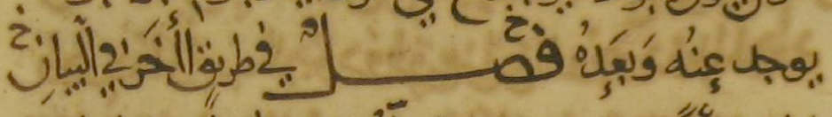

يوجد عنه وبعده خ فصل في طرىق اأخر ٯي البيان خ

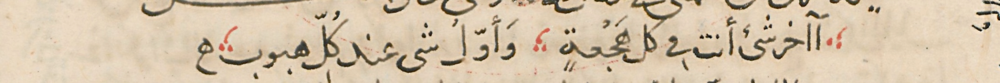

اآخر شئ أنت ٯى كل هجعة وأول شى عند كل هبوب

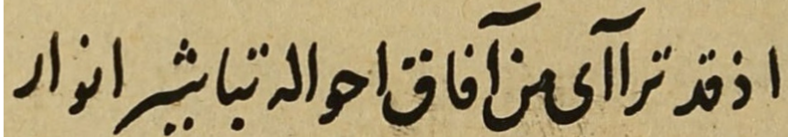

اذ قد تراآى من آفاق احواله تباشير انوار

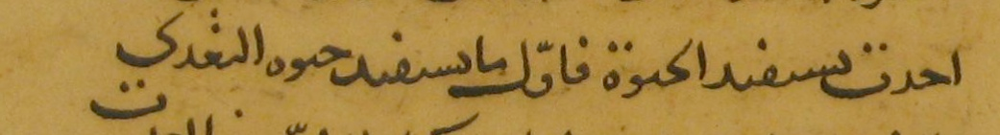

احدت ىسىفىد الحىوة فاول ما ىسىفىد حىوه التعدى

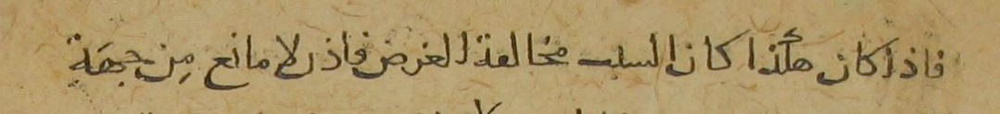

فاذا كان هكذا كان السبٮ مخالڡة الغرض فاذں لا مانع من جهة

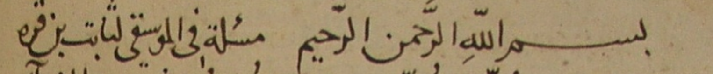

بسم الله الرحمن الرحيم مسئلة فى الموسيقى لثابت بن قره

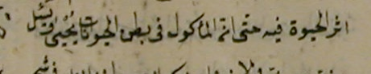

اثر الحيوة فيه حتى ان المأكول فى بطن الحيوانات يحيى ويسئل

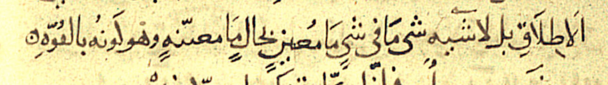

الاطلاق بل لا شيه شى ما فى شى ما معينه بحال ما معىنه وهو كونه بالڡوه

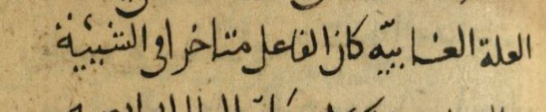

العلة الغاييه كان الفاعل متاخرا ٯى الشيئية

ابعد المواضع عن الفلك وذاك هو الوسط واذا كان الما يتلوا الأرض ٯى هذا المعنى

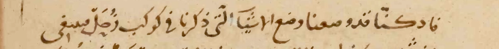

فاد كنا قد وصعنا وضع الاشيا التى ذكرنا فى كوكب زحل ٯىىىغى

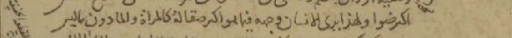

اكىر ضوا ولهذا يرى الانسان وجهه فيما هو اكىر صقالة كالمراة والما دون ما ليس

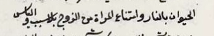

الحيوان بالنار وامتناع المراة من الزوج بلا سبب والياس

