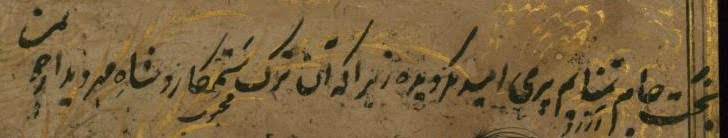

# Layout & Segmentation

Although layout is not conventionally part of transcription standards, some features of Arabic-script manuscripts require specific treatment in ATR. Line images supplied to the recognizer should have a consistent vertical extent and an approximately linear progression. These guidelines use the common baseline-and-bounding-polygon model for manuscript lines.

Segmentation that violates these conditions can degrade model performance. The recommendations involve some judgment, but minor differences in difficult cases are not expected to affect recognition accuracy substantially.

## Above- or below-line additions

Keep an addition with the main line when it does not significantly change the line's vertical extent. Otherwise, segment the addition as a separate line.

## Curved baselines and heaped elements

Segment a heaped element on a separate baseline when connecting it to the rest of the line would require an abrupt change in baseline direction. If it can be connected with a smooth baseline, keep it with the line.

## Marginalia

Marginalia are always segmented as separate lines or regions.

> For reading order in multi-column, glossed, and commentary layouts, see [Open Questions](community.md#reading-order).
